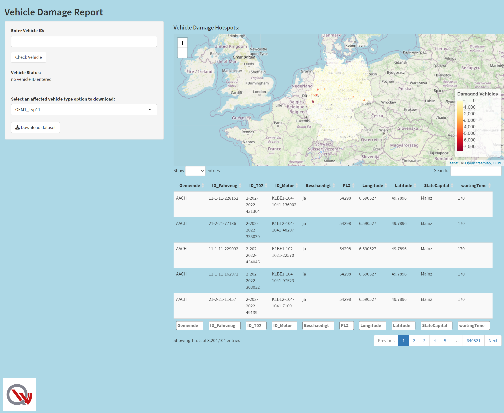
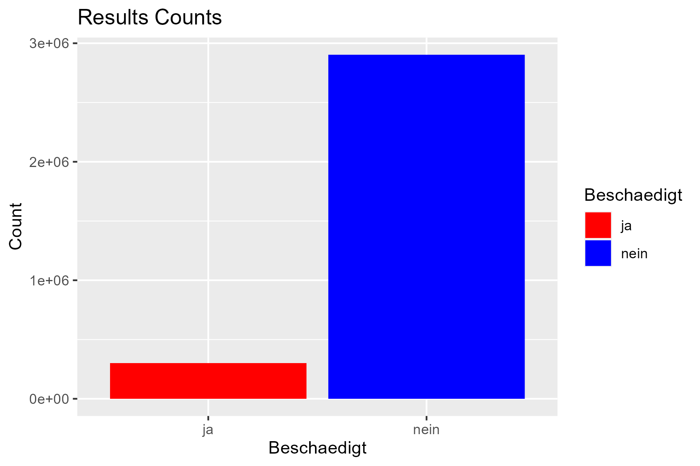
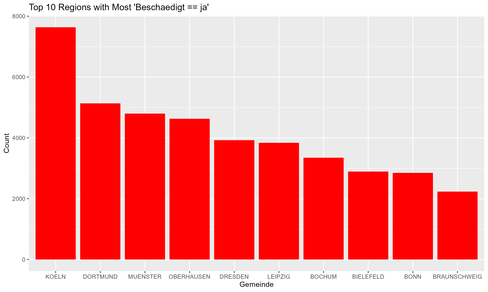
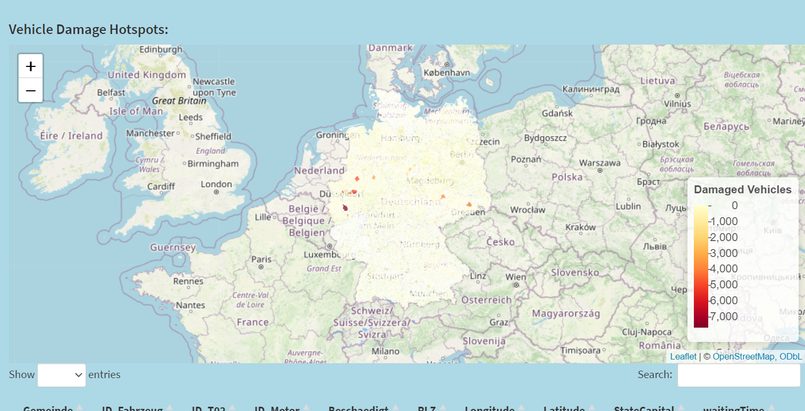
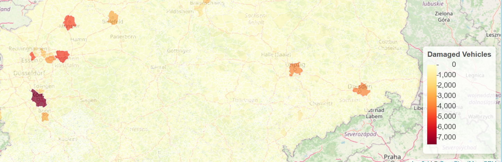
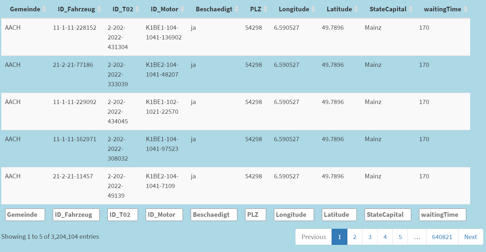

All the steps to create our final datasheet can be found in data_cleaning.R.

# Importing the data

In this section, we import the data for further analysis. We only imported the necessary datasets. These were:
  - Fahrzeuge_OEM1_Typ11.csv
  - Fahrzeuge_OEM1_Typ12.csv
  - Fahrzeuge_OEM2_Typ21.csv
  - Fahrzeuge_OEM2_Typ22.csv
  - Bestandteile_Fahrzeuge_OEM1_Typ11.cs
  - Bestandteile_Fahrzeuge_OEM1_Typ12.cs
  - Bestandteile_Fahrzeuge_OEM2_Typ21.cs
  - Bestandteile_Fahrzeuge_OEM2_Typ22.cs
  - Bestandteile_Komponente_K1BE1.csv
  - Bestandteile_Komponente_K1BE2.csv
  - Einzelteil_T02.txt
  - Zulassungen_alle_Fahrzeuge.csv
  - Geodaten_Gemeinden_v1.2_2017-08-22_TrR.csv
  
Additional to the provided datasheets we needed tWO more data sources to get additional geographical information for the Shiny-App:
  - georef-germany-postleitzahl.csv
  - germany_municipalities.shp

The steps for this process were as followed:

- **Loading vehicle dataframes:**
  - We load vehicle data from two different Original Equipment Manufacturers (OEMs) ("Fahrzeuge_OEM1_Typ11.csv", "Fahrzeuge_OEM1_Typ12.csv", "Fahrzeuge_OEM2_Typ21.csv", and "Fahrzeuge_OEM2_Typ22.csv").
  - The most important columns are "ID_Fahrzeug" and "Produktionsdatum".

- **Loading vehicle part dataframes:**
  - We load vehicle part data from both OEMs ("Bestandteile_Fahrzeuge_OEM1_Typ11.csv", "Bestandteile_Fahrzeuge_OEM1_Typ12.csv", "Bestandteile_Fahrzeuge_OEM2_Typ21.csv" and "Bestandteile_Fahrzeuge_OEM2_Typ22.csv")
  - "ID_Fahrzeug" and "ID_Motor" are the most relevant columns from those SataFrames
   
- **Loading the component dataframes:**
  - We load vehicle part data from both OEMs ("Bestandteile_Komponente_K1BE1.csv" and "Bestandteile_Komponente_K1BE2.csv")
  - we need the "ID_K1BE1" and "ID_T2" column
   
- **Loading control unit T02 dataframe:**
   - We load control unit T02 data from a text file ("Einzelteil_T02.txt")
   - "Herstellernummer", "Produktionsdatum", "Werksnummer", "Fehlerhaft_Datum", "Fehlerhaft_Fahrleistung", "Fehlerhaft_Datum" and "Fehlerhaft" columns are used
   
- **Loading registrations dataframe:**
  - We load registration data for all vehicles ("Zulassungen_alle_Fahrzeuge.csv")
  - We need the "Gemeinden" and "IDNummer" columns

- **Loading geo dataframe:**
  - We load geo location data for each municipality ("Geodaten_Gemeinden_v1.2_2017-08-22_TrR.csv")
  - The columns that describe "Gemeinde", "Postleitzahl", Longitude" and "Latitude" are relevant for us
  
- **Loading further geo data:**
  - We load data regarding the state capitals ("georef-germany-postleitzahl.csv")
  - Relevant columns are "Name" and "Land.Code" that describes a number for each state

- **Loading data for the heatmap map:**
  - We loaded a shapefile (.shp) that includes all map information about the municipalities in Germany ("germany_municipalities.shp"). This dataset was downloaded from "opendata-esri-de.opendata.arcgis.com" and was created by the "Federal Agency for Cartography and Geodesy" of Germany. Because it is official data from the state of Germany it can be seen as trustful.

# Data Preparation

After the loading of the Dataframes, the data needed to be prepared for further analysis. Those were the steps for the data preparation:

- **Parse to the right date format:**
  - Parse the production date of datasheets "Fahrzeuge_OEM2_Typ21.csv" and "Fahrzeuge_OEM2_Typ22.csv" in the form: "%d-%m-%Y"
  - Drop the old column with the wrong production date format

- **Controll the vehicle dataframes:**
  - Check if all dataframes have the same column names to prevent errors.
  - Concatenate the dataframes
  - Check if all vehicle ID's are unique and if all vehicles are in the time bound from the task (2016-12-31 to 2008-01-01)

- **Controll and mutate the vehicle parts dataframes:**
  - Check if all dataframes have the same column names to prevent errors.
  - Concatenate the dataframes
  - Mutate the rows to  only get the engine Type
    
- **Prepare the components dataframes:**
  - Select only the relevant columns ("ID_K1BE1" and "ID_T2")
  - Concat the component dataframes
    
- **Prepare the control unit T02 dataframe:**
  - Remove " from strings
  - Split on tabs and on spaces
  - Create a new dataframe from the data and give it the correct column names.
  - Keep only the part of the framework that originate from the producer 202 to get a consistend dataframe. 202 because of the task: damaged vehicles were only manufactured by this producer.

- **Prepare the geo dataframe:**
  - Change the longitude and latitude from a string to a floatingpoint number
  - Add the folating point to numbers that have it missing, eg. 56778 instead of 56.778
  - Only keep the needed "Gemeinde", "Postleitzahl", Longitude" and "Latitude" column
  - Add the municipality with the name "SEEG" because this one is missing in the geo dataset
  - Find the state capital to each municipality with the help of the zip code
  - Calculate distance to state capital for each municipality

This section of the document prepares the data for subsequent analysis and ensures data consistency and quality for further investigation.

# Creation of the final data set
- **Filter the dataframes for task specific things:**
  - Filter the vehicle parts dataframe for the gasoline engine “K1BE1” and “K1BE2” because those are the two damaged engine types
  - At the the control unit T02 dataframe from the pre-processing we have the parts that originate from the producer 202. Now we filter for the correct Plant Id (2022) and make sure that the dates align with our information (from 2010-12-31 to 2008-04-01).

- **Join the dataframes:**
  - Join the vehicles and df_fahrzeug_teile via ID_Fahrzeug to get the MotorID added to each vehicle
  - Join the result and the components dataframe via ID_Motor to get the T2 ID
  - Join the results and the control unit T02 dataframe to only keep vehicles with affected T2 units
  - Join the result and the registrations dataframe to get the municipalities of affected vehicles
  - Add the column "Beschaedigt" and give each vehicle the lable ja", because at this point we only have the damaged vehicles left in the dataframe
  - Merge the result with the geo dataframe by the same "Gemeinde" to add the "StateCapital", "waitingTime", "Postleitzahl", "Longitude" and "Latitude" to the final dataframe. AT this point we have all information for the damaged vehicles that we need, but we dont have the functioning vehicles anymore
  
- **Add functioning vehicles back:**
  - Take all registered vehicles from ("Zulassungen_alle_Fahrzeuge.csv")
  - Add the geo data "PLZ", "Gemeinde", "Longitude" and "Latitude". The functioning vehicles are only needed for the heatmap. For that we only need the geo location. At this point we have all the necessary information
  - Set all the other columns ("ID_T02", "ID_Motor", "Beschaedigt", "StateCapital" and "waitingTime") to default values
  - Remove all vehicles from the functioning vehicles dataframe that are also in the damaged vehicles dataframe
  - Join the functioning vehicles with the damaged vehicles
                     
This final dataframe was written to the CSV file named "Final_dataset_group_17.csv.". The unused dataframes were removed.

# Evaluation

- **Data Quality Assessment:**
  The data provided and the geographical data that we added didn't match at some points. One of the biggest issues was that the municipalities from the provided data are not the current ones and that they missed some. Because of that we had to add some municipalities and their geo data in the code. We also couldnt just use the municipalities for the heatmap, we had to do a spatial join and use the "Longitude" and "Latitude" again because of the missing municipalities. Municipalities that don't occur in the provided data just have 0 vehicles in the heatmap.
  The postcodes in the geo data in the provided data are wrong at some points as well. It is mainly because some postcodes were combined with others or deleted recently. So we also had to add some postcodes manually to match the provided data and prevent data loss.
  Overall the geo data was just a bit old but it is important to say that only very few vehicles were affected by it.
  We didn't have had problems with missing data in the other datasets and made sure that we didnt loose data during the process (eg. in the end the number of vehicles is the same than from the begin).
  
  
- **Data Transformation and Preparation:**
  Because we always analyzed and looked at the datasheets extensively before we wrote the code, we didn't have had a lot of problems with this step. We fixed all data mistakes that we recognized (eg. the missing floating point in some geo location data, as mentioned before).
  
- **Data Integration:**
  When we combined the datasheets to get the final sheet with all the damaged vehicles, we tried to fulfill all requirements from the task. We ignored the "Fehlerhaft" column in the "Einzelteil_T02.txt" datasheet on purpose because we imagined the scenario as follows: If we know that T02 parts are wrong from the manufacturer "202§ in the plant "2022", we have to controll all those vehicles because the risk of a false negative is way to high for vehicles. 
  We added the functioning vehicles again in the end because we needed them for the heatmap (the piecharts in the popups). We added them later because we didn't need a lot of calculations for them (eg. the distance to the state capital or the waiting time).

# Result

The App fulfills the UI-task (light blue, font family and logo). The heatmap and final datasheet is integrated. There exist a box to test a vehicle and download vehicle type specific information.

AS result we got that ~10% of the provided ~3'000'000 vehicles are damaged. We can see that in the popups: most piecharts have around 10% damaged vehicles. This is also logical because if vehicles were delivered in a region, the proportion of damaged vehicles should be the mean. The damage doesn't depend on the region. The regions where the largest number of vehicles were delivered have also the largest number of damaged vehicles.

We kept the following columns in the final datasheet: "Gemeinde", "ID_Fahrzeug", "ID_T02", "ID_Motor", "Beschaedigt", "PLZ", "Longitude", "Latitude", "StateCapital" and "waitingTime". We decided to keep those columns because they prove why we marked a vehicle as damaged ("Beschaedigt" == "ja") and they prove the waiting time and the location on the heatmap. So without any of those columns we coudn't get all the needed information.

